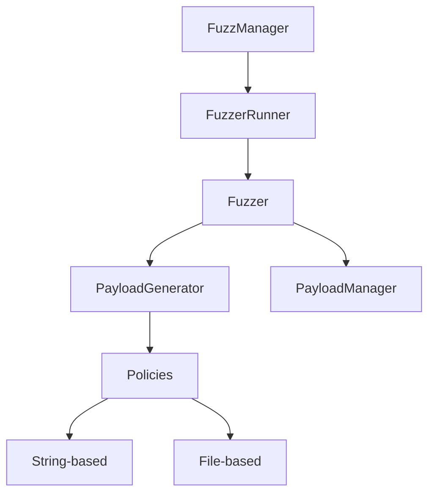
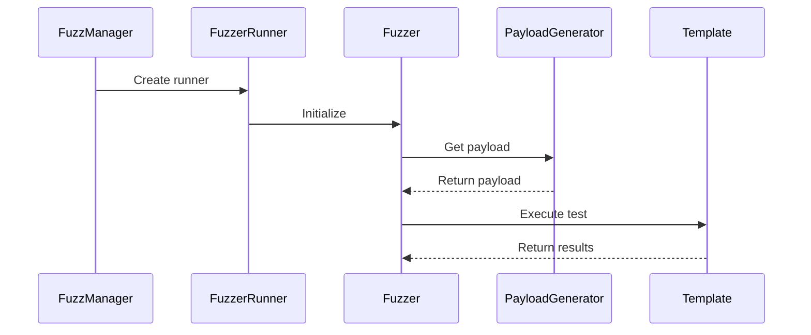

# Framework Implementation Details

## Architecture Overview



## Core Components

### 1. Fuzzer
- Template-agnostic orchestrator
- Handles payload generation and management
- Executes tests via templates
- Manages test results and logging

### 2. PayloadGenerator
- Implements fuzzing policies
- Handles state management
- Supports both string and file-based policies

### 3. PayloadManager
- Manages payload history
- Implements FIFO with size limits
- Handles file operations safely

### 4. FuzzerRunner & FuzzManager
- Enables parallel fuzzing
- Manages process lifecycle
- Handles graceful shutdown

## Data Flow



## Extending the Framework

### Adding New Policies
```python
@file_based_policy  # If file-based
def new_policy(self, **kwargs) -> Union[str, None]:
    # Generate payload
    return payload
```

### Template Requirements
- Accept --target parameter
- Accept --payload or --file
- Handle target-specific logic internally